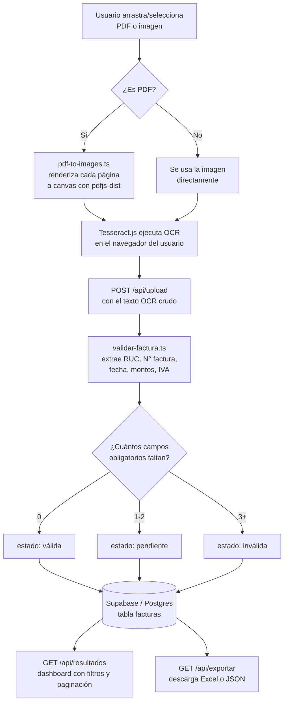

<div align="center">

# 🧾 Validador de Facturas — Paraguay

### Carga tu factura, deja que el OCR la lea, y obtén una validación automática en segundos.

[](https://nextjs.org/)
[](https://react.dev/)
[](https://www.typescriptlang.org/)
[](https://supabase.com/)
[](https://tailwindcss.com/)
[](https://github.com/naptha/tesseract.js)
[](https://vercel.com/)

**100% OCR en el navegador · Sin backend Python · Sin servidor de OCR separado**

</div>

---

## 📋 Tabla de contenidos

1. [¿Qué es este proyecto?](#-qué-es-este-proyecto)
2. [Objetivo](#-objetivo)
3. [Características principales](#-características-principales)
4. [Cómo funciona (arquitectura)](#-cómo-funciona-arquitectura)
5. [Stack tecnológico](#-stack-tecnológico)
6. [Estructura del proyecto](#-estructura-del-proyecto)
7. [Requisitos previos](#-requisitos-previos)
8. [Instalación y puesta en marcha](#-instalación-y-puesta-en-marcha)
9. [Variables de entorno](#-variables-de-entorno)
10. [Modelo de datos (Supabase)](#-modelo-de-datos-supabase)
11. [Motor de validación: cómo se extraen y validan los datos](#-motor-de-validación-cómo-se-extraen-y-validan-los-datos)
12. [Referencia de la API](#-referencia-de-la-api)
13. [Scripts disponibles](#-scripts-disponibles)
14. [Despliegue en Vercel](#-despliegue-en-vercel)
15. [Seguridad y consideraciones](#-seguridad-y-consideraciones)
16. [Limitaciones conocidas del MVP](#-limitaciones-conocidas-del-mvp)
17. [Roadmap sugerido](#-roadmap-sugerido)
18. [Licencia](#-licencia)

---

## 🔍 ¿Qué es este proyecto?

**Validador de Facturas** es una aplicación web pensada para el mercado paraguayo que permite **subir facturas en formato PDF o foto**, **extraer automáticamente sus datos mediante OCR** (reconocimiento óptico de caracteres) y **validarlas** según las reglas de formato vigentes en Paraguay (RUC, número de timbrado, fecha de emisión, montos en guaraníes, IVA 10%/5%/exentas).

Todo el procesamiento de OCR ocurre **directamente en el navegador del usuario** gracias a [Tesseract.js](https://github.com/naptha/tesseract.js) — no hay backend en Python, no hay microservicio de OCR, no hay colas de procesamiento externas. [Next.js](https://nextjs.org/) se encarga de servir tanto el frontend como las rutas de API, y [Supabase](https://supabase.com/) (Postgres) actúa como base de datos.

El resultado es un dashboard donde se puede ver, filtrar, buscar, eliminar y exportar (Excel o JSON) el listado de facturas procesadas, junto con un resumen estadístico de cuántas son válidas, inválidas o están pendientes de revisión.

---

## 🎯 Objetivo

Agente que pre-valida archivos masivos detectando anomalías estadísticas o lógicas mediante IA antes de procesar.

Concretamente, busca:

- **Eliminar la carga manual de datos** que hoy se hace a mano al recibir una factura física o escaneada.
- **Detectar errores de formato** (RUC mal escrito, número de factura incompleto, monto ilegible) antes de que lleguen a contabilidad.
- **Centralizar el historial de facturas procesadas** en un solo lugar, con búsqueda y exportación a Excel para auditoría o carga en otros sistemas.
- Servir como **MVP rápido de validar y desplegar**, priorizando velocidad de iteración (sin login, sin infraestructura pesada) sobre robustez de producción — algo explícitamente documentado para que el equipo sepa qué se sacrificó y por qué.

---

## ✨ Características principales

- 📤 **Carga múltiple por drag & drop** de archivos PDF, JPG, PNG, WEBP, BMP o TIFF (hasta 10 MB cada uno), procesados en cola de forma secuencial.
- 🔎 **OCR 100% client-side** con Tesseract.js en español e inglés, optimizado para texto numérico (modo de segmentación de página `SINGLE_BLOCK`).
- 📄 **Conversión de PDF a imágenes en el navegador** con `pdfjs-dist` (cada página se renderiza a escala 3x antes del OCR, para maximizar precisión).
- 🧠 **Motor de extracción y validación** que reconoce automáticamente RUC emisor/receptor, número de factura (timbrado), fecha de emisión, monto total, IVA 10%, IVA 5% y exentas — tolerante a errores comunes de OCR (confusión `O`/`0`, `l`/`1`, separadores de miles con punto o coma, montos partidos en líneas distintas, etc.).
- 🚦 **Clasificación automática por estado**: `válida`, `pendiente` o `inválida`, según la cantidad de campos obligatorios que falten.
- 📊 **Dashboard con estadísticas en vivo**: total procesadas, válidas, inválidas, pendientes y suma total en guaraníes.
- 🔍 **Filtros y búsqueda** por estado, RUC, número de factura o nombre de archivo, con paginación.
- 🗂️ **Vista expandible por fila** para inspeccionar RUC receptor, desglose de IVA y la lista de errores de validación de cada factura.
- 🗑️ **Eliminación de registros** con confirmación.
- 📥 **Exportación a Excel (.xlsx) o JSON**, respetando los filtros activos.
- 🌓 **Modo claro/oscuro** automático según las preferencias del sistema.
- ⚡ **Sin servidor dedicado de OCR**: el despliegue completo cabe en el plan gratuito de Vercel + Supabase.

---

## 🧠 Cómo funciona (arquitectura)



**Punto clave:** ningún archivo ni imagen se sube a un servidor para hacer OCR. Solo el **texto ya extraído** (resultado del OCR) viaja al backend, lo cual reduce drásticamente el ancho de banda necesario y evita tener que manejar almacenamiento de archivos binarios.

---

## 🛠️ Stack tecnológico

| Categoría | Tecnología | Versión | Uso en el proyecto |
|---|---|---|---|
| Framework | [Next.js](https://nextjs.org/) | 16.2.6 | App Router, frontend + API routes en un solo proyecto |
| UI | [React](https://react.dev/) | 19 | Componentes de interfaz |
| Lenguaje | [TypeScript](https://www.typescriptlang.org/) | 5.7.3 | Tipado estático en todo el proyecto |
| Estilos | [Tailwind CSS](https://tailwindcss.com/) | 4.2 | Utilidades de estilo + variables de tema (claro/oscuro) |
| Componentes UI | [shadcn/ui](https://ui.shadcn.com/) (estilo `base-nova`) | 4.8.0 | Botones, tablas, badges, tabs, select, etc. |
| Iconos | [lucide-react](https://lucide.dev/) | 1.16.0 | Set de iconos SVG |
| Base de datos | [Supabase](https://supabase.com/) (Postgres) | — | Almacenamiento de facturas procesadas |
| Cliente Supabase | `@supabase/ssr`, `@supabase/supabase-js` | 0.12 / 2.108 | Clientes para browser y server |
| OCR | [Tesseract.js](https://github.com/naptha/tesseract.js) | 7.0.0 | Reconocimiento óptico de caracteres en el navegador (idiomas `spa` + `eng`) |
| PDF → imagen | [pdfjs-dist](https://github.com/mozilla/pdf.js) | 6.0.227 | Renderizado de páginas PDF a canvas para el OCR |
| Exportación | [xlsx (SheetJS)](https://www.npmjs.com/package/xlsx) | 0.18.5 | Generación de reportes Excel |
| Data fetching | [SWR](https://swr.vercel.app/) | 2.4.1 | Cache y revalidación de datos del dashboard |
| Analítica | [@vercel/analytics](https://vercel.com/docs/analytics) | 1.6.1 | Analítica de uso en producción |
| Linting | ESLint + `eslint-config-next` | 9.39 / 16.2.9 | Calidad de código |
| Hosting recomendado | [Vercel](https://vercel.com/) | — | Despliegue serverless |

---

## 📁 Estructura del proyecto

```
Factura_Validator/
├── app/
│   ├── page.tsx                    # Página principal (renderiza el Dashboard)
│   ├── layout.tsx                  # Layout raíz: fuentes, metadata, analytics
│   ├── globals.css                 # Variables de tema (colores claro/oscuro)
│   └── api/
│       ├── upload/route.ts         # POST → valida texto OCR y guarda en Supabase
│       ├── resultados/route.ts     # GET  → lista facturas (filtros + paginación)
│       ├── facturas/[id]/route.ts  # DELETE → elimina una factura por ID
│       └── exportar/route.ts       # GET  → exporta a Excel (.xlsx) o JSON
│
├── components/
│   ├── dashboard.tsx                # Orquesta tabs, filtros, upload y stats (usa SWR)
│   ├── upload-zone.tsx              # Drag & drop + cola de OCR en el navegador
│   ├── facturas-table.tsx           # Tabla con filtros, búsqueda, paginación y export
│   ├── stats-cards.tsx              # Tarjetas de resumen (válidas/inválidas/pendientes)
│   ├── estado-badge.tsx             # Badge visual según el estado de la factura
│   └── ui/                          # Componentes base de shadcn/ui (button, table, tabs...)
│
├── lib/
│   ├── validar-factura.ts           # ⭐ Lógica de extracción y validación (el corazón del proyecto)
│   ├── pdf-to-images.ts             # Convierte PDF en canvases para el OCR
│   ├── types.ts                     # Tipos TypeScript compartidos (Factura, EstadoFactura...)
│   ├── utils.ts                     # Utilidades varias (cn, etc.)
│   └── supabase/
│       ├── client.ts                # Cliente Supabase para el navegador
│       └── server.ts                # Cliente Supabase para rutas API / server components
│
├── supabase/
│   └── schema.sql                   # Script SQL para crear la tabla `facturas` + RLS
│
├── public/                          # Íconos y assets estáticos
├── .env.local                       # Credenciales de Supabase (NO se sube a git)
├── .gitignore
├── components.json                  # Configuración de shadcn/ui
├── next.config.mjs
├── package.json
└── tsconfig.json
```

---

## ✅ Requisitos previos

Antes de instalar el proyecto necesitás:

| Requisito | Versión mínima | Notas |
|---|---|---|
| [Node.js](https://nodejs.org/) | 20 o superior | Verificá con `node -v` |
| npm | 10 o superior (viene con Node) | También funciona con `pnpm` o `yarn` |
| Cuenta en [Supabase](https://supabase.com) | Plan gratuito | Para la base de datos Postgres |
| Cuenta en [GitHub](https://github.com) | — | Para versionar el código |
| Cuenta en [Vercel](https://vercel.com) | Plan gratuito (Hobby) | Para el despliegue |
| Navegador moderno | Chrome, Edge, Firefox, Safari recientes | El OCR corre en el navegador, así que el rendimiento del cliente importa |

> 💡 No se necesita Python, Docker, ni ningún servidor de OCR externo. Todo corre con Node.js y el navegador.

---

## 🚀 Instalación y puesta en marcha

### 1. Clonar o descomprimir el proyecto

```bash
cd Factura_Validator
```

### 2. Instalar dependencias

```bash
npm install
```

### 3. Crear el proyecto en Supabase

1. Entra a [supabase.com/dashboard](https://supabase.com/dashboard) y creá un proyecto nuevo (plan gratuito).
2. En el menú lateral, abrí **SQL Editor**.
3. Copiá todo el contenido de [`supabase/schema.sql`](./supabase/schema.sql), pegalo en el editor y dale **Run**.
   - Esto crea la tabla `facturas`, sus índices y las políticas de seguridad (RLS) del MVP.
4. Andá a **Project Settings → API** y copiá:
   - **Project URL**
   - **anon public key**

### 4. Configurar las variables de entorno

Creá (o editá) el archivo `.env.local` en la raíz del proyecto:

```bash
NEXT_PUBLIC_SUPABASE_URL=https://tu-proyecto.supabase.co
NEXT_PUBLIC_SUPABASE_ANON_KEY=tu-anon-key-aqui
```

> ⚠️ Este archivo ya está incluido en `.gitignore`, así que nunca se sube al repositorio. Revisá igual que tus credenciales reales no terminen versionadas por error antes de cada `git add`.

### 5. Levantar el servidor de desarrollo

```bash
npm run dev
```

Abrí [http://localhost:3000](http://localhost:3000) — deberías ver el dashboard. Probá subir una foto o un PDF de una factura desde la pestaña **"Cargar Factura"**.

> Si `npm run dev` falla, verificá que tenés Node 20+ (`node -v`) y que corriste `npm install` dentro de la carpeta correcta (donde está `package.json`).

---

## 🔐 Variables de entorno

| Variable | Obligatoria | Descripción |
|---|---|---|
| `NEXT_PUBLIC_SUPABASE_URL` | Sí | URL del proyecto Supabase (`https://xxxx.supabase.co`) |
| `NEXT_PUBLIC_SUPABASE_ANON_KEY` | Sí | Clave pública (anon) de Supabase, usada por el cliente y el servidor |

Ambas son variables `NEXT_PUBLIC_*`, lo cual significa que **se exponen al navegador** (esto es intencional: Supabase está diseñado para que la `anon key` sea pública y la seguridad real recaiga en las políticas RLS de la base de datos — ver la sección [Seguridad](#-seguridad-y-consideraciones)).

---

## 🗄️ Modelo de datos (Supabase)

La tabla `facturas` (definida en [`supabase/schema.sql`](./supabase/schema.sql)) tiene la siguiente estructura:

| Columna | Tipo | Descripción |
|---|---|---|
| `id` | `uuid` (PK) | Identificador único, autogenerado |
| `nombre_archivo` | `text` | Nombre del archivo original subido |
| `ruc_emisor` | `text` | RUC del emisor, formato `########-#` |
| `ruc_receptor` | `text` | RUC del receptor, mismo formato |
| `numero_factura` | `text` | Número de timbrado, formato `001-001-0000001` |
| `fecha_emision` | `text` | Fecha en formato `dd/mm/yyyy` |
| `monto_total` | `numeric` | Monto total en guaraníes |
| `iva_10` | `numeric` | Monto liquidado al 10% de IVA (si aparece) |
| `iva_5` | `numeric` | Monto liquidado al 5% de IVA (si aparece) |
| `exentas` | `numeric` | Monto exento de IVA (si aparece) |
| `estado` | `text` | `valida` \| `invalida` \| `pendiente` |
| `errores` | `text[]` | Lista de motivos por los que faltó algún dato |
| `texto_crudo` | `text` | Texto completo devuelto por el OCR (para auditoría/debug) |
| `creado_en` | `timestamptz` | Fecha y hora de carga |

Incluye índices sobre `estado`, `creado_en` y `ruc_emisor` para que los filtros del dashboard respondan rápido.

### Seguridad de la tabla (RLS)

El script habilita **Row Level Security** con políticas abiertas de lectura, inserción y borrado, ya que este MVP **no tiene autenticación** (es de un solo usuario). Esto está documentado explícitamente dentro del propio `schema.sql` para que quede claro que **antes de manejar datos reales o múltiples usuarios** hay que reemplazar estas políticas por reglas basadas en Supabase Auth.

---

## 🧮 Motor de validación: cómo se extraen y validan los datos

Toda la inteligencia de negocio vive en [`lib/validar-factura.ts`](./lib/validar-factura.ts). Recibe el texto crudo que devolvió el OCR y aplica una serie de expresiones regulares y heurísticas pensadas específicamente para el formato paraguayo:

### Campos extraídos

| Campo | ¿Obligatorio? | Formato esperado | Estrategia de extracción |
|---|---|---|---|
| RUC emisor | Sí | `########-#` | Se toma el primer RUC encontrado en el texto |
| RUC receptor | Sí | `########-#` | Se toma el segundo RUC encontrado |
| N° de factura | Sí | `001-001-0000001` | Tolera separación por guiones o espacios (ruido típico de OCR) |
| Fecha de emisión | Sí | `dd/mm/yyyy` o `dd-mm-yyyy` | Primera coincidencia en el texto |
| Monto total | Sí | Número en guaraníes | Busca etiquetas como "TOTAL DE LA OPERACIÓN", "TOTAL EN GUARANÍES", "TOTAL A PAGAR", con varios niveles de fallback |
| IVA 10% / IVA 5% / Exentas | No | Número en guaraníes | Se extraen si la etiqueta correspondiente aparece en el texto |

### Normalización de ruido de OCR

Antes de aplicar las expresiones regulares, el texto pasa por una limpieza que corrige confusiones típicas del OCR:

- `O` (letra) junto a dígitos → `0`
- `l` / `I` (letras) junto a dígitos → `1`
- `$` mal reconocido en vez de `Gs` → `S`

### Interpretación de montos en guaraníes

El guaraní **no usa decimales**, por lo que el punto y la coma son casi siempre separadores de miles. La función `limpiarMonto()` aplica esta lógica:

- Si hay **múltiples puntos o comas** → todos son separadores de miles (`1.500.000` → `1500000`).
- Si hay **una sola coma seguida de 3 dígitos** → es separador de miles (`146,296` → `146296`).
- Si hay **un solo punto seguido de 3 dígitos** → es separador de miles (`1.500` → `1500`).
- Casos exóticos con decimales reales (`1.500,50`) también se contemplan como fallback.
- Se eliminan espacios que el OCR a veces inserta entre grupos de dígitos (`1 500 000` → `1500000`).

Además, la búsqueda de montos no se limita a una sola línea: si la etiqueta y el valor quedaron separados por el OCR (por ejemplo "TOTAL" en una línea y el número en la siguiente), el motor revisa también la línea siguiente antes de darse por vencido.

### Determinación del estado

```
errores.length === 0   →  estado = "valida"
errores.length <= 2    →  estado = "pendiente"
errores.length >= 3    →  estado = "invalida"
```

Cada campo obligatorio que no se logra extraer agrega un mensaje a la lista de `errores`, la cual queda guardada junto con la factura para que el usuario sepa exactamente qué faltó revisar.

---

## 🌐 Referencia de la API

Todas las rutas viven bajo `app/api/` y corren en el runtime de Node.js (`export const runtime = 'nodejs'`).

### `POST /api/upload`

Recibe el texto ya extraído por OCR (en el navegador), lo valida y lo guarda en Supabase.

**Body (JSON):**
```json
{
  "nombre_archivo": "factura_001.pdf",
  "texto_crudo": "texto completo devuelto por Tesseract.js"
}
```

**Respuesta exitosa (200):**
```json
{ "ok": true, "factura": { "id": "...", "estado": "valida", "...": "..." } }
```

### `GET /api/resultados`

Lista facturas con filtros y paginación.

| Query param | Tipo | Default | Descripción |
|---|---|---|---|
| `page` | number | 1 | Número de página |
| `pageSize` | number | 10 | Tamaño de página (máx. 50) |
| `estado` | string | — | `valida` \| `invalida` \| `pendiente` \| `todos` |
| `busqueda` | string | — | Busca en RUC emisor/receptor, número de factura o nombre de archivo |

**Respuesta:**
```json
{ "data": [ /* facturas */ ], "total": 42, "page": 1, "pageSize": 10 }
```

### `DELETE /api/facturas/[id]`

Elimina una factura por su `id` (UUID).

### `GET /api/exportar`

Genera un archivo descargable con las facturas filtradas.

| Query param | Tipo | Default | Descripción |
|---|---|---|---|
| `formato` | string | `xlsx` | `xlsx` o `json` |
| `estado` | string | — | Mismo filtro que en `/api/resultados` |
| `busqueda` | string | — | Mismo filtro que en `/api/resultados` |

Devuelve el archivo con cabeceras `Content-Disposition: attachment`, listo para descargar (`facturas.xlsx` o `facturas.json`).

---

## 📦 Scripts disponibles

| Comando | Descripción |
|---|---|
| `npm run dev` | Levanta el servidor de desarrollo en `http://localhost:3000` |
| `npm run build` | Genera el build de producción |
| `npm run start` | Sirve el build de producción ya generado |
| `npm run lint` | Corre ESLint sobre todo el proyecto |

---

## ☁️ Despliegue en Vercel

1. Subí el proyecto a un repositorio de GitHub:
   ```bash
   git init
   git add .
   git commit -m "Initial commit: validador de facturas MVP"
   git remote add origin https://github.com/TU-USUARIO/TU-REPO.git
   git branch -M main
   git push -u origin main
   ```
2. Entrá a [vercel.com/new](https://vercel.com/new) e importá el repositorio recién creado.
3. En **Environment Variables**, agregá las mismas dos variables de tu `.env.local`:
   - `NEXT_PUBLIC_SUPABASE_URL`
   - `NEXT_PUBLIC_SUPABASE_ANON_KEY`
4. Hacé clic en **Deploy**.

En 1-2 minutos vas a tener una URL pública (`tu-proyecto.vercel.app`) con la app funcionando, lista para compartir.

---

## 🔒 Seguridad y consideraciones

- **Sin autenticación.** Cualquiera con la URL pública puede usar la app y ver/eliminar todas las facturas cargadas. Esto es intencional para el MVP, pero **no es apto para datos sensibles o producción multiusuario** sin agregar Supabase Auth.
- **RLS abierto a propósito.** Las políticas en `supabase/schema.sql` permiten lectura, inserción y borrado público sobre la tabla `facturas`. Están comentadas en el propio archivo para que el cambio a políticas restringidas sea explícito y fácil de encontrar.
- **La `anon key` es pública por diseño** de Supabase — la seguridad real depende de las políticas RLS, no de mantener la key en secreto. Aun así, evitá versionar `.env.local` (ya está en `.gitignore`).
- **OCR en el cliente.** Ningún archivo de factura se envía a un servidor; solo el texto ya extraído. Esto reduce el riesgo de exposición de documentos originales, pero implica que el texto crudo (`texto_crudo`) sí queda almacenado en la base de datos para fines de auditoría.

---

## ⚠️ Limitaciones conocidas del MVP

- **Un solo usuario, sin login** — no hay roles ni permisos diferenciados.
- **OCR sensible a la calidad de imagen.** Funciona bien con facturas digitales, escaneadas o fotos nítidas; **no reconoce bien facturas manuscritas** ni fotos borrosas o con poca luz.
- **Tamaño máximo de archivo: 10 MB** por archivo (configurado en `upload-zone.tsx`).
- **Carga manual únicamente** — todavía no hay integración con email, SFTP, WhatsApp ni otros sistemas de ingesta automática.
- **Procesamiento secuencial.** Los archivos en cola se procesan uno por uno (no en paralelo) para evitar saturar el navegador con múltiples workers de Tesseract.js simultáneos.
- **No valida el dígito verificador del RUC** ni hace consulta contra el padrón de la SET (Subsecretaría de Estado de Tributación) — solo valida formato y presencia de los campos.

Estas limitaciones son intencionales: el objetivo del MVP es comprobar que el flujo completo (**subir → OCR → validar → revisar → exportar**) funciona y es usable, antes de invertir en una versión más robusta.

---

## 🗺️ Roadmap sugerido

- [ ] Autenticación de usuarios con Supabase Auth + políticas RLS por organización.
- [ ] Validación del dígito verificador del RUC paraguayo.
- [ ] Integración con el padrón de contribuyentes de la SET para verificar RUCs reales.
- [ ] Soporte para Documentos Tributarios Electrónicos (DTE / e-Kuatia).
- [ ] Procesamiento en paralelo controlado (pool de workers) para acelerar cargas masivas.
- [ ] Historial de cambios y reprocesamiento manual de facturas marcadas como "pendiente".
- [ ] Notificaciones (email/Slack) cuando se detecta una factura inválida.

---

## 📄 Licencia

Este proyecto no incluye actualmente un archivo de licencia. Si pensás distribuirlo, abrir el código o compartirlo públicamente, te recomendamos agregar una (por ejemplo [MIT](https://choosealicense.com/licenses/mit/) si querés permitir uso y modificación libres).

---

<div align="center">

**Hecho para automatizar la validación de facturas en Paraguay 🇵🇾**

</div>